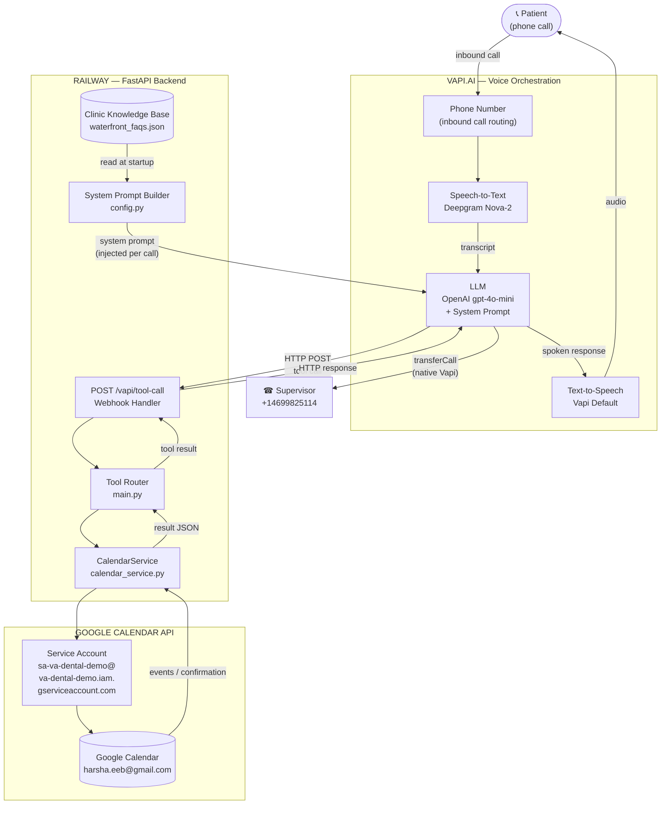
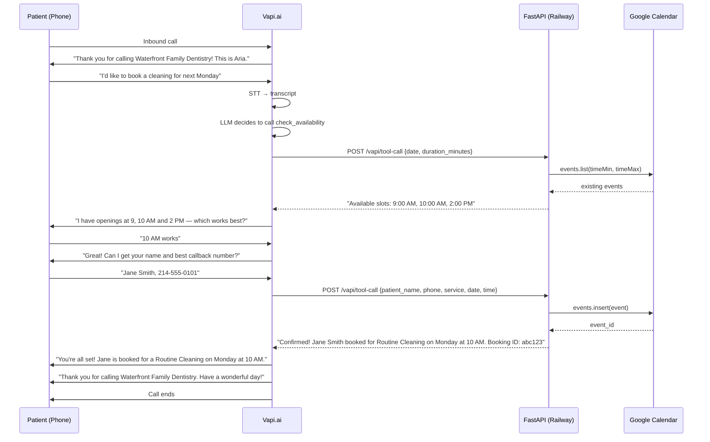
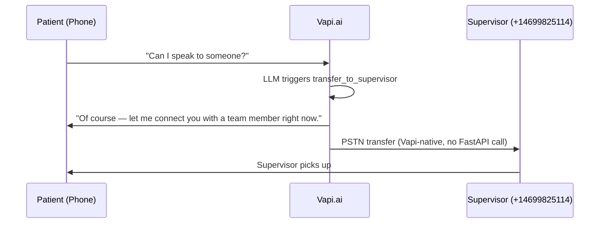
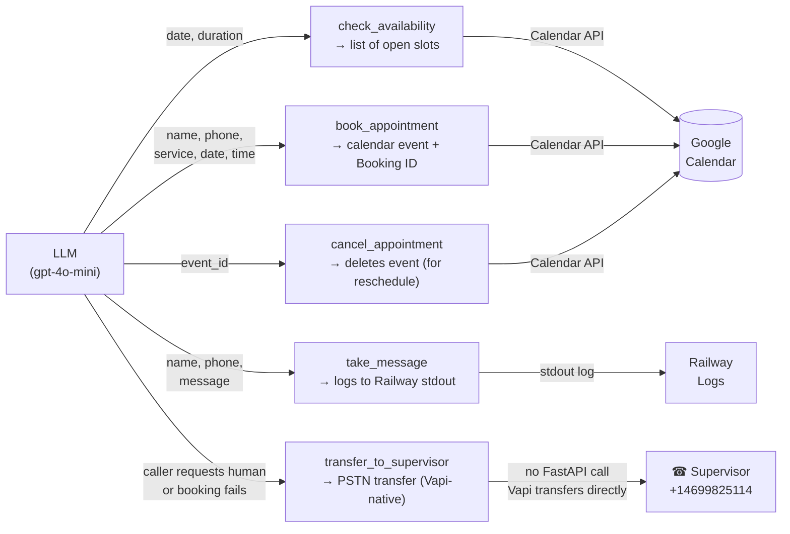
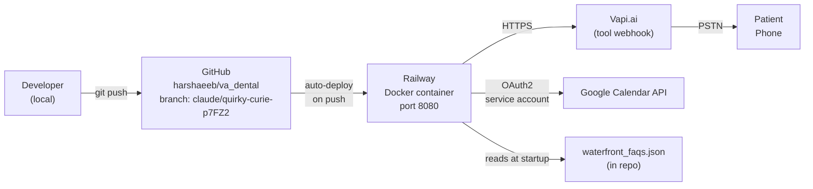

# Architecture — Waterfront Family Dentistry Voice Agent

## System Overview

Aria is a voice AI receptionist that answers inbound phone calls for a dental clinic. It uses Vapi.ai as the voice orchestration layer, a Python/FastAPI backend hosted on Railway as the tool execution server, and Google Calendar for appointment management.

---

## High-Level Block Diagram



---

## Call Flow — Sequence Diagram



### Transfer Flow — Caller Requests a Human



---

## Component Breakdown

### 1. Vapi.ai (Voice Orchestration)
| Sub-component | Technology | Role |
|--------------|-----------|------|
| Phone Number | Vapi PSTN | Routes inbound calls |
| Speech-to-Text | Deepgram Nova-2 (en-US) | Converts patient speech to text |
| LLM | OpenAI gpt-4o-mini, temp 0.4 | Drives conversation, decides when to call tools |
| Text-to-Speech | Vapi Default | Converts Aria's responses to audio |
| Tool definitions | Inline in `model.tools` | Tells LLM when/how to call backend tools |
| Call Transfer | Vapi `transferCall` (native) | PSTN transfer to supervisor — no FastAPI involved |

**Key design choice:** Tools are defined *inline* in the assistant config (not as pre-created Vapi tool objects). This ensures tool results are properly routed back to the LLM.

### 2. FastAPI Backend (Railway)
| File | Responsibility |
|------|--------------|
| `main.py` | Webhook handler, tool dispatcher |
| `calendar_service.py` | Google Calendar API wrapper |
| `config.py` | Builds system prompt from JSON data |
| `data/waterfront_faqs.json` | Clinic knowledge base (hours, services, FAQs, insurance, loyalty program) |

**Endpoint:** `POST /vapi/tool-call`  
**Health check:** `GET /health`

### 3. Google Calendar API
- Auth via service account (`google-credentials.json` / `GOOGLE_CREDENTIALS_JSON` env var)
- Reads events to find free slots (8 AM–5 PM window, 30-min increments, 15-min buffers)
- Creates events with patient name, phone, service, and reminders
- Deletes events for cancellations/rescheduling

### 4. Clinic Knowledge Base (`waterfront_faqs.json`)
Loaded at startup and rendered into the system prompt. Contains:
- Clinic name, address, phone, email, hours
- 24 bookable services with durations (20–90 min)
- Insurance plans accepted
- Loyalty Program details (for uninsured patients)
- Provider profiles (Dr. Lavi, 20+ years)
- Technology (digital X-rays, laser dentistry)
- 33 FAQs covering common caller questions

---

## The 5 Tools



### Tool Transfer Triggers

`transfer_to_supervisor` fires when either condition is met:
1. Caller asks to speak to a person, representative, supervisor, or the doctor
2. Aria cannot book or confirm an appointment due to a calendar or system error

On transfer failure, Aria falls back to `take_message` to collect the caller's details for a callback.

---

## Deployment Architecture



**Environment variables on Railway:**
```
GOOGLE_CREDENTIALS_JSON   # Full service account JSON (secret)
GOOGLE_CALENDAR_ID        # harsha.eeb@gmail.com
CLINIC_TIMEZONE           # America/Chicago
CLINIC_NAME               # Waterfront Family Dentistry
VAPI_API_KEY              # Vapi secret key
SUPERVISOR_PHONE          # +14699825114 — destination for call transfers
```

---

## Key Design Decisions

| Decision | Rationale |
|----------|-----------|
| Inline Vapi tools (not pre-created toolIds) | Pre-created tools route results incorrectly; LLM never sees tool responses |
| No `request-complete` messages in tools | Caused agent silence — LLM generated empty response after filler audio |
| `{{currentDateTime}}` in system prompt | LLM defaults to training data year (2024); Vapi injects real date at call time |
| `cancel_appointment` before rebook | Without explicit cancel, a reschedule creates a duplicate calendar event |
| `replace(tzinfo=None)` on Calendar datetimes | Google returns timezone-aware datetimes; slot times are naive — stripping tzinfo prevents crash |
| Lazy-load `CalendarService` | Server boots cleanly without credentials; fails gracefully only when a calendar tool is called |
| `GOOGLE_CREDENTIALS_JSON` env var | Railway has no filesystem persistence; inlining credentials as an env var avoids file management |
| gpt-4o-mini over Anthropic models | Vapi requires a separate Anthropic API key; OpenAI models work with Vapi's built-in key |
| `transferCall` tool type (not a function tool) | Vapi handles PSTN transfer natively — no HTTP round-trip to FastAPI, lower latency, no server-side code needed |
| Fallback to `take_message` on transfer failure | If the supervisor line is unreachable, caller details are still captured rather than losing the caller entirely |

---

## Data Flow Summary

```
Patient speech
  → Deepgram STT (transcript)
  → gpt-4o-mini + system prompt (decides action)
  → [if calendar tool needed] HTTP POST to FastAPI /vapi/tool-call
      → Google Calendar API (read/write)
      → result JSON back to Vapi
  → [if transfer triggered] Vapi transferCall (PSTN, no FastAPI involved)
      → call bridged to supervisor at +14699825114
  → gpt-4o-mini (formulates spoken reply)
  → Vapi TTS (audio)
  → Patient hears response
```

---

## Security Notes

- `google-credentials.json` is **gitignored** — never committed to the repo
- Google credentials are passed to Railway via the `GOOGLE_CREDENTIALS_JSON` environment variable
- Vapi API key is stored in local `.env` (gitignored) and Railway environment variables only
- Service account has calendar access only — no broader GCP permissions
